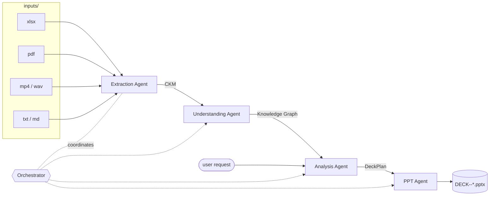

# Agent Team — Documentation

A modular team of agents that ingests **any mix of source formats** (xlsx, pdf,
video, audio, text) on the fly, normalises them into a **Canonical Knowledge
Model (CKM)**, builds a **Knowledge Graph**, and generates **PowerPoint learning
material** from natural-language requests — all coordinated by an **Orchestrator**.

## Docs index

| Doc | What's inside |
|---|---|
| [architecture.md](architecture.md) | System overview, data flow, the two phases |
| [components.md](components.md) | Every component explained, with per-component diagrams |
| [data-model.md](data-model.md) | CKM + Knowledge Graph schemas and the artifacts on disk |
| [usage.md](usage.md) | Setup, how to run, configuration, troubleshooting |
| [azure-services-devops.md](azure-services-devops.md) | Azure services required/recommended, provisioning and DevOps checklist |

## 30-second view

## The team at a glance

| # | Agent | Input | Output | File |
|---|---|---|---|---|
| 1 | Extraction | source files | CKM | [extraction_agent.py](../extraction_agent.py) |
| 2 | Understanding | CKM | Knowledge Graph | [understanding_agent.py](../understanding_agent.py) |
| 3 | Analysis | graph + user request | DeckPlan | [analysis_agent.py](../analysis_agent.py) |
| 4 | PPT | DeckPlan | `.pptx` | [ppt_agent.py](../ppt_agent.py) |
| — | Orchestrator | inputs + requests | runs the team | [orchestrator.py](../orchestrator.py) |

See [usage.md](usage.md) to run it.
