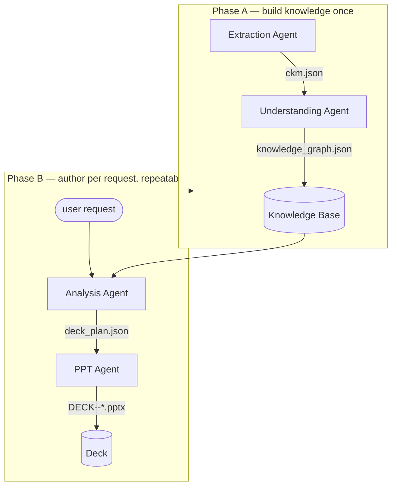
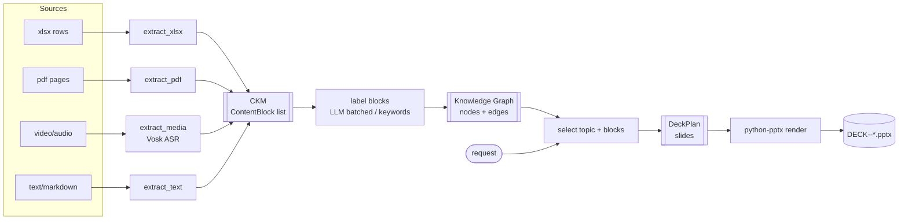
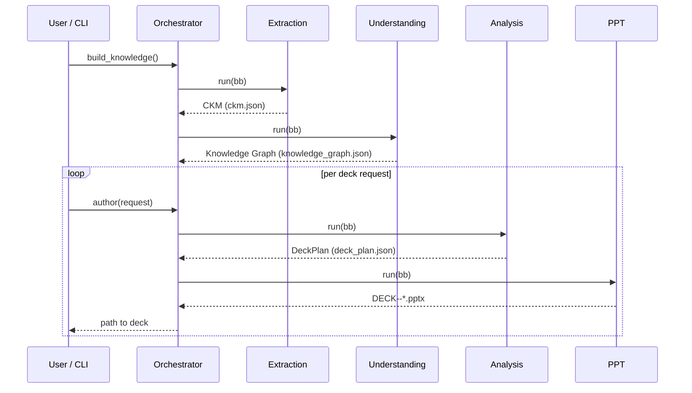
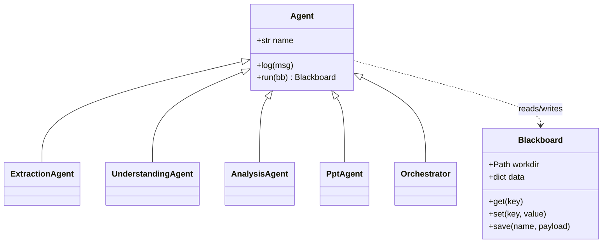

# Architecture

## Design principles

1. **One canonical model** — every source format is normalised into the same
   `ContentBlock` list (the CKM). Downstream agents never touch raw files.
2. **Modular agents over a shared Blackboard** — each agent reads/writes a shared
   in-memory `Blackboard` and persists its artifact to `outputs/`. Stages are
   composable and independently re-runnable.
3. **LLM-optional** — every agent has a deterministic fallback, so the whole team
   runs fully offline. Azure OpenAI, when configured, only improves quality.
4. **Config/registry extension points** — new formats and slide layouts are added
   by registering one function, not by rewriting the pipeline.

## Two phases

The orchestrator separates expensive knowledge-building from cheap authoring, so
you build the knowledge base **once** and generate **many** decks.

## End-to-end data flow

## Runtime sequence

## Shared runtime

The `Blackboard` ([base.py](../base.py)) is the single source of truth passed
between agents. Keys used: `ckm`, `graph`, `topics`, `request`, `deck_plan`,
`pptx_path`.
