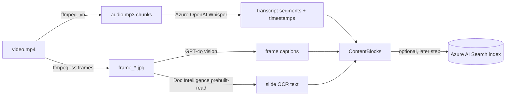

# Azure Video Extraction — Design & Implementation Guide

> Context: The extraction layer (`extraction_agent.py` → `extractors.py`) currently
> extracts video/audio with **Vosk** (offline ASR) + **ffmpeg** frame grabs. This
> document describes how to move video extraction (transcript + images) onto Azure
> using **only the services we have access to**.

---

## 1. Available services (and what each one does)

We have **only** these three Azure services. There is **no** Video Indexer and **no**
Speech Service, so the "upload a video and get everything back" path is not available.
We assemble the result ourselves instead.

| Service | Role in video extraction |
|---------|--------------------------|
| **Azure OpenAI** (LLM) | Whisper deployment → audio transcription with timestamps; GPT‑4o vision → frame captioning / on‑screen text |
| **Azure AI Search** | Destination index for the extracted blocks (retrieval) — a step *after* extraction, not part of it |
| **Azure Document Intelligence** | `prebuilt-read` OCR for text‑heavy frames (slides, screenshares) |
| **ffmpeg** (local, already used) | Mechanical work only: demux audio + grab frames at timestamps |

---

## 2. Why this split

There is no single Azure service in our stack that ingests a video and returns
transcript + images. So we break the problem into pieces and route each piece to the
right tool:

- **Frame extraction** is a *mechanical* operation. Only Video Indexer would do it as a
  managed service, and we don't have it → keep **ffmpeg** (already in `_grab_frames`).
- **Transcription** is the *intelligence* layer → **Azure OpenAI Whisper** replaces Vosk
  and gives better accuracy plus segment‑level timestamps.
- **Turning a frame into text** (so visuals become searchable) → **GPT‑4o vision** for a
  one‑line description, and/or **Document Intelligence** `prebuilt-read` for dense slide OCR.



---

## 3. Step-by-step

### Step 1 — Transcript via Azure OpenAI Whisper
- Whisper has a **25 MB upload limit**, so compress audio to **mono mp3 @ 64 kbps** and
  **split by time** (e.g. 600 s chunks), offsetting timestamps per chunk.
- Use `response_format="verbose_json"` to get `segments` with `start` / `end` / `text`.
- Each segment becomes a `ContentBlock(modality="transcript", timestamp=start, ...)` —
  identical shape to the current Vosk output, so nothing downstream changes.
- **Fallback model:** if no Whisper deployment exists, `gpt-4o-transcribe` /
  `gpt-4o-mini-transcribe` use the same `audio.transcriptions.create` call.

### Step 2 — Frames
- Reuse the existing `_grab_frames` helper in `extractors.py`. It already samples up to
  `MEDIA_MAX_FRAMES` timestamps and writes JPEGs to `ASSETS_DIR`. **No change needed.**

### Step 3 — Make frames into text (the part Azure adds)
- **GPT‑4o vision** → one‑sentence description + verbatim on‑screen text.
- **Document Intelligence** `prebuilt-read` → precise OCR for slide‑heavy frames.
- Fold the result back into the block so it is searchable:
  ```python
  b.image_ref = str(frame_path)
  caption = _caption_frame(frame_path)      # and/or _ocr_frame(frame_path)
  b.metadata["caption"] = caption
  b.text = f"{b.text}\n[visual] {caption}".strip()
  ```

---

## 4. Integration points

- Add a new extractor `extract_media_azure(path, on_block)` that **mirrors** the existing
  `extract_media`: same cache file (`<file>.transcript.json`), same `_emit` / `_slug`
  helpers, same `ContentBlock` output.
- Point the media extensions at it in the `EXTRACTORS` dict:
  ```python
  ".mp4": extract_media_azure, ".mov": extract_media_azure,
  ".mkv": extract_media_azure, ".avi": extract_media_azure,
  ".wav": extract_media_azure, ".m4a": extract_media_azure,
  ```
- `ExtractionAgent` in `extraction_agent.py` needs **zero changes** — it only calls
  `extract_file`, which dispatches through `EXTRACTORS`.

---

## 5. Environment variables

```dotenv
# already present (see llm.py)
AZURE_OPENAI_ENDPOINT=https://<name>.openai.azure.com/
AZURE_OPENAI_API_KEY=<key>
AZURE_OPENAI_DEPLOYMENT=gpt-4o
AZURE_OPENAI_API_VERSION=2024-10-21

# new for video extraction
AZURE_OPENAI_WHISPER_DEPLOYMENT=whisper
AZURE_DOCINTEL_ENDPOINT=https://<name>.cognitiveservices.azure.com/
AZURE_DOCINTEL_KEY=<key>
```

---

## 6. Reference snippets

### Whisper transcription (chunked)
```python
import subprocess, imageio_ffmpeg, tempfile, os
from pathlib import Path
from openai import AzureOpenAI

def _client() -> AzureOpenAI:
    return AzureOpenAI(
        azure_endpoint=os.environ["AZURE_OPENAI_ENDPOINT"],
        api_key=os.environ["AZURE_OPENAI_API_KEY"],
        api_version=os.getenv("AZURE_OPENAI_API_VERSION", "2024-10-21"),
    )

def _transcribe_whisper(path: Path, chunk_secs: int = 600) -> list[dict]:
    ffmpeg = imageio_ffmpeg.get_ffmpeg_exe()
    segments: list[dict] = []
    with tempfile.TemporaryDirectory() as tmp:
        pattern = Path(tmp) / "chunk_%03d.mp3"
        subprocess.run(
            [ffmpeg, "-y", "-i", str(path), "-vn", "-ac", "1", "-ar", "16000",
             "-c:a", "libmp3lame", "-b:a", "64k",
             "-f", "segment", "-segment_time", str(chunk_secs), str(pattern)],
            check=True, stdout=subprocess.DEVNULL, stderr=subprocess.DEVNULL,
        )
        client = _client()
        deploy = os.getenv("AZURE_OPENAI_WHISPER_DEPLOYMENT", "whisper")
        for idx, chunk in enumerate(sorted(Path(tmp).glob("chunk_*.mp3"))):
            offset = idx * chunk_secs
            with chunk.open("rb") as fh:
                r = client.audio.transcriptions.create(
                    model=deploy, file=fh, response_format="verbose_json")
            for seg in (getattr(r, "segments", None) or []):
                segments.append({
                    "start": float(seg["start"]) + offset,
                    "end": float(seg["end"]) + offset,
                    "text": (seg["text"] or "").strip(),
                })
    return segments
```

### GPT-4o vision caption
```python
import base64, os

def _caption_frame(img_path: Path) -> str:
    b64 = base64.b64encode(img_path.read_bytes()).decode()
    client = _client()
    resp = client.chat.completions.create(
        model=os.getenv("AZURE_OPENAI_DEPLOYMENT", "gpt-4o"),
        messages=[{"role": "user", "content": [
            {"type": "text", "text": "Describe this video frame in one sentence "
             "and transcribe any visible on-screen text verbatim."},
            {"type": "image_url",
             "image_url": {"url": f"data:image/jpeg;base64,{b64}"}},
        ]}],
        temperature=0.2,
    )
    return (resp.choices[0].message.content or "").strip()
```

### Document Intelligence OCR (slide frames)
```python
import os
from azure.ai.documentintelligence import DocumentIntelligenceClient
from azure.core.credentials import AzureKeyCredential

def _ocr_frame(img_path: Path) -> str:
    di = DocumentIntelligenceClient(
        endpoint=os.environ["AZURE_DOCINTEL_ENDPOINT"],
        credential=AzureKeyCredential(os.environ["AZURE_DOCINTEL_KEY"]),
    )
    with img_path.open("rb") as f:
        poller = di.begin_analyze_document(
            "prebuilt-read", body=f, content_type="application/octet-stream")
    return (poller.result().content or "").strip()
```
> Note: `prebuilt-read` on a single frame needs **no** `features` parameter. (Passing
> `features=['figures']` is only for PDF layout and returns an InvalidArgument here.)

---

## 7. Cost & performance notes

- **Whisper:** ~$0.006 / minute of audio.
- **Vision captioning** every frame adds up — keep `MEDIA_MAX_FRAMES` capped and consider
  **deduplicating near-identical frames** (e.g. perceptual hash) before captioning.
- **Document Intelligence** `prebuilt-read`: per-page billing; only run it on frames that
  are clearly slide/text heavy.
- **Azure AI Search** is the *destination* for the finished blocks (vector + keyword
  retrieval), not part of extraction. Embed `block.text` with an Azure OpenAI embedding
  deployment and push to an index in a separate indexing step after the CKM is built.
