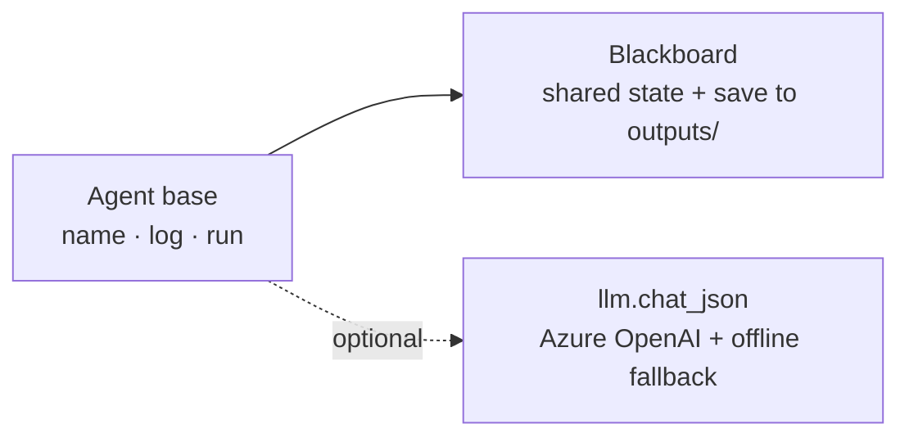
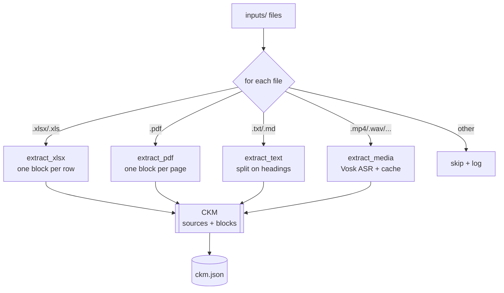
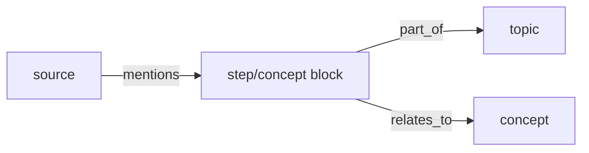
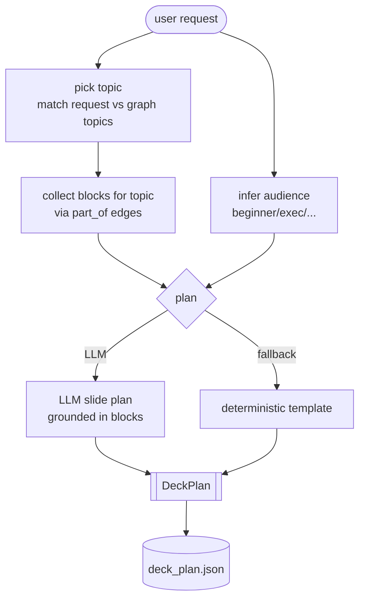
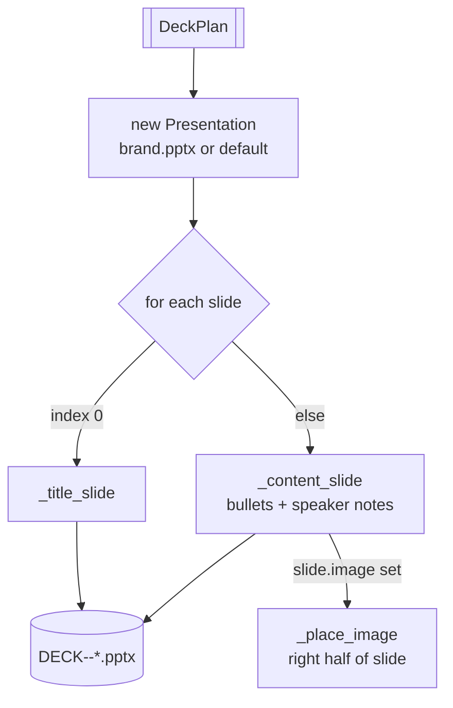
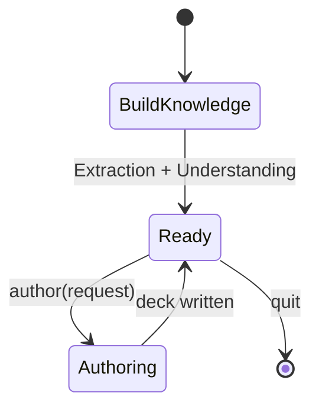

# Components

Each component is small and single-purpose. This page explains what each one
does, its inputs/outputs, and how to extend it.

---

## Shared runtime — `base.py`, `llm.py`



- **Blackboard** ([base.py](../base.py)) — dict-like shared state with a
  `save()` that serialises Pydantic models to `outputs/*.json`.
- **Agent** ([base.py](../base.py)) — base class; every agent implements `run(bb)`.
- **llm** ([llm.py](../llm.py)) — one `chat_json()` helper. Returns `None` when
  Azure OpenAI isn't configured, so callers fall back to deterministic logic.
  Loads the package-local `.env` and auto-trusts corporate TLS certs.

---

## 1. Extraction Agent — `extraction_agent.py` + `extractors.py`

Scans the inputs folder, dispatches each file to a format extractor by suffix,
and assembles the CKM. One bad file is logged and skipped — it never kills the run.



- **Registry**: `EXTRACTORS` in [extractors.py](../extractors.py) maps suffix → function.
- **Visuals**: PDFs contribute their largest embedded figure per page; videos
  contribute sampled frames grabbed at transcript timestamps (cap via
  `MEDIA_MAX_FRAMES`, default 60). Both are written to `outputs/assets/` and the
  block's `image_ref` points at them.
- **Media cache**: transcripts (and their frame refs) are cached next to the
  source (`<file>.transcript.json`) so re-runs skip re-transcription.
- **Extend**: add a function returning `list[ContentBlock]` and register it in
  `EXTRACTORS`.

---

## 2. Understanding Agent — `understanding_agent.py`

Turns the flat CKM into a graph of topics, concepts, steps and sources. Blocks
are labelled in **LLM batches** (cheap on large corpora) with a keyword fallback.

```mermaid
flowchart TD
    CKM[[CKM blocks]] --> LBL{label blocks}
    LBL -->|LLM available| BATCH[batch of 25\nllm.chat_json]
    LBL -->|no LLM / over budget| KW[keyword extraction]
    BATCH --> LBLS[(topic, concepts) per block]
    KW --> LBLS
    LBLS --> BUILD[build nodes + edges]
    BUILD --> G[[Knowledge Graph]]
    G --> SAVE[(knowledge_graph.json)]
```

**Graph shape**



- **Budget knobs** (env): `UNDERSTANDING_BATCH` (default 25),
  `UNDERSTANDING_MAX_LLM_BLOCKS` (default 300). Set the latter to `0` to force
  the offline keyword path.
- **Extend**: change node/edge construction or add new relation types in
  [understanding_agent.py](../understanding_agent.py).

---

## 3. Analysis Agent — `analysis_agent.py`

The "data analysis" brain. Takes a natural-language request + the graph and
produces a concrete `DeckPlan`. Interactive: `analyze()` can be called repeatedly.
It also attaches available visuals from the selected blocks to content slides.



- **Grounding**: the LLM is instructed to use source blocks only (no invented facts).
- **Extend**: adjust topic selection, audience detection, or the slide template in
  [analysis_agent.py](../analysis_agent.py).

---

## 4. PPT Agent — `ppt_agent.py`

Renders a `DeckPlan` into a `.pptx`. `python-pptx` is its tool; each slide layout
is a small method so new styles are easy to add. Uses `templates/brand.pptx` as
the master if present.



- **Images**: when a `SlidePlan.image` is set, bullets are narrowed to the left
  half and the visual is placed on the right.
- **Extend**: add a `_xxx_slide()` method and call it from `build()` in
  [ppt_agent.py](../ppt_agent.py).

---

## Orchestrator — `orchestrator.py` + `run.py`

Owns the Blackboard and wires the four agents into the two phases.



- `build_knowledge()` runs Phase A once.
- `author(request)` runs Phase B and returns the deck path; call it repeatedly.
- [run.py](../run.py) is the CLI: `--request` for one-shot, or omit it for an
  interactive prompt loop.
