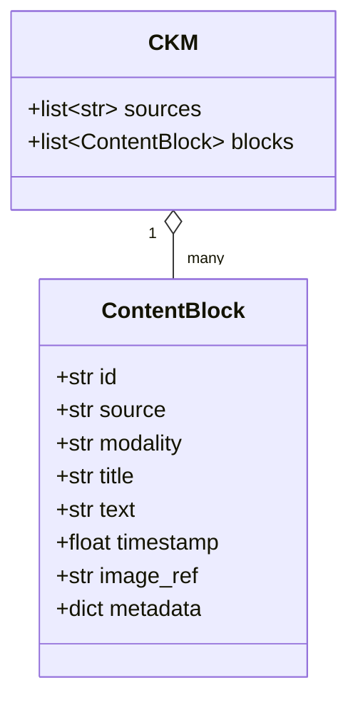
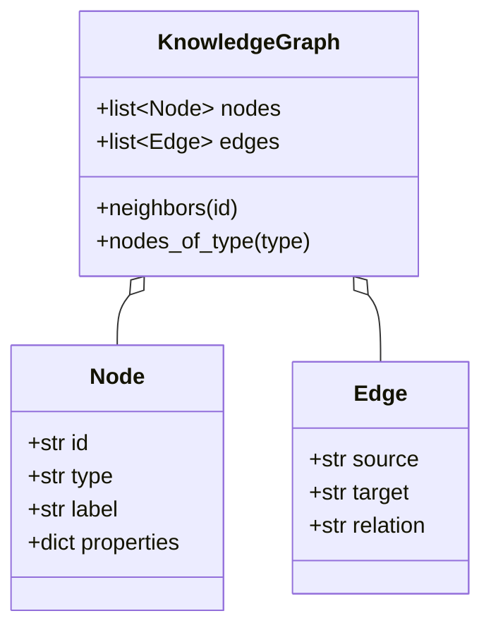
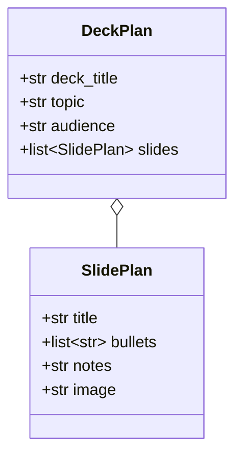
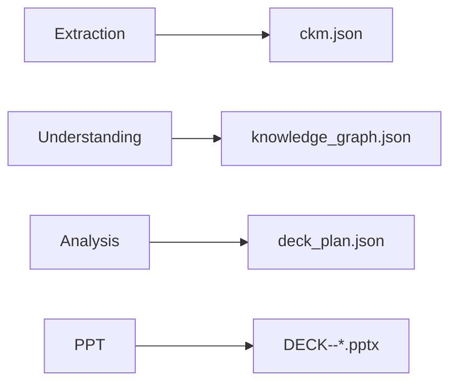

# Data Model

All schemas live in [ckm.py](../ckm.py) (Pydantic) and
[analysis_agent.py](../analysis_agent.py) (`DeckPlan`).

## Canonical Knowledge Model (CKM)

The format-agnostic representation every agent works against.

| Field | Meaning |
|---|---|
| `id` | stable slug, unique per block |
| `source` | originating filename |
| `modality` | `text` · `table_row` · `transcript` · `heading` · `step` |
| `title` | short label |
| `text` | the content |
| `timestamp` | seconds into media (video/audio only) |
| `image_ref` | path to an extracted visual (video frame / pdf figure), or `None` |
| `metadata` | format-specific extras (e.g. xlsx `sheet`, `fields`) |

## Knowledge Graph

- **Node types**: `source`, `topic`, `concept`, `step`.
- **Edge relations**: `mentions` (source→block), `part_of` (block→topic),
  `relates_to` (block→concept).
- Node ids are namespaced: `src::`, `topic::`, `concept::`, `blk::`.

## DeckPlan

## Artifacts on disk (`outputs/`)

| File | Written by | Contents |
|---|---|---|
| `ckm.json` | Extraction | full CKM |
| `knowledge_graph.json` | Understanding | nodes + edges |
| `deck_plan.json` | Analysis | the plan for the last request |
| `DECK--<title>.pptx` | PPT | the generated deck |
| `assets/*.jpg` / `assets/*.png` | Extraction | extracted visuals (video frames, pdf figures) |
| `<media>.transcript.json` | Extraction | cached ASR transcript + frame refs (next to source) |
