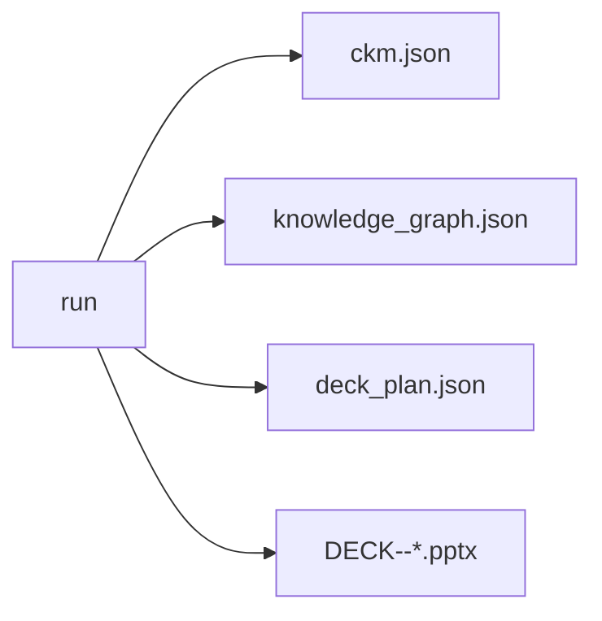
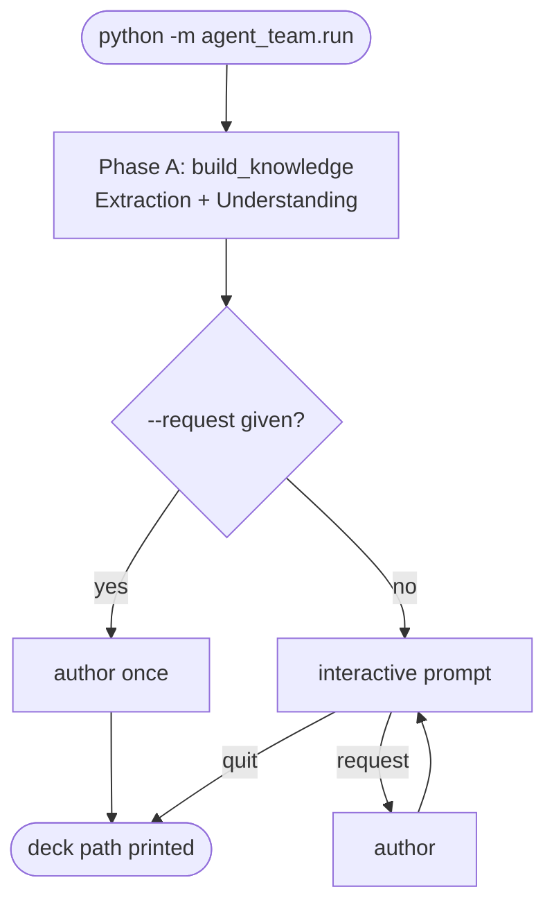

# Usage

## 1. Install

```powershell
cd "agent_team"
python -m venv .venv
.\.venv\Scripts\Activate.ps1
pip install -r requirements.txt
```

Optional dependencies map to formats — install only what you need:

| You want to ingest | Package(s) |
|---|---|
| `.xlsx` / `.xls` | `openpyxl` |
| `.pdf` | `pypdf` |
| `.mp4` / `.wav` / audio+video | `vosk`, `imageio-ffmpeg` (+ a Vosk model) |
| `.txt` / `.md` | none (built-in) |
| LLM-quality output | `openai` + Azure OpenAI credentials |

## 2. Configure (optional)

```powershell
copy .env.example .env
```

```ini
# agent_team/.env  — all optional; without these the team runs fully offline
AZURE_OPENAI_ENDPOINT=https://<resource>.openai.azure.com/
AZURE_OPENAI_API_KEY=<key>
AZURE_OPENAI_DEPLOYMENT=gpt-4o
AZURE_OPENAI_API_VERSION=2024-08-01-preview

# Optional override for the Vosk model used by video/audio transcription
VOSK_MODEL_PATH=

# Max video frames sampled per media file (evenly spaced) for slide visuals
MEDIA_MAX_FRAMES=60

# Cost/scale knobs for the Understanding agent on large corpora
UNDERSTANDING_BATCH=25            # blocks per LLM labelling call
UNDERSTANDING_MAX_LLM_BLOCKS=300  # 0 = force offline keyword labelling
```

> Without Azure credentials the team still runs: understanding falls back to
> keyword extraction and deck planning to a deterministic template.

Video/audio transcription reuses the offline **Vosk** model from
`../tetris_mvp/models/vosk-model-small-en-us-0.15` by default.

## 3. Run

Drop any mix of files into `inputs/`, then:

**One-shot** — build knowledge and generate one deck:

```powershell
python -m agent_team.run --request "beginner deck on opportunity creation"
```

**Interactive** — build knowledge once, ask for many decks:

```powershell
python -m agent_team.run
# Knowledge base ready. Available topics: ...
# > executive summary deck
# > advanced deck on pricing
# > quit
```

**Point at another inputs folder** (e.g. the tetris_mvp samples):

```powershell
python -m agent_team.run --inputs "..\tetris_mvp\inputs" --request "guided practice for sales users"
```

### CLI options

| Flag | Default | Meaning |
|---|---|---|
| `--inputs` | `agent_team/inputs` | folder of source files |
| `--out` | `agent_team/outputs` | where artifacts are written |
| `--template` | `agent_team/templates/brand.pptx` | optional master deck |
| `--request` | — | deck request; omit for interactive mode |

## 4. Outputs

Everything lands in `outputs/`:



## Run flow



## Troubleshooting

| Symptom | Cause / fix |
|---|---|
| `Vosk model not found` | Install a model or set `VOSK_MODEL_PATH`; or remove media files from `inputs/` |
| Understanding is slow on big xlsx | Lower `UNDERSTANDING_MAX_LLM_BLOCKS` or set it to `0` |
| Decks look generic | Add Azure OpenAI credentials to `.env` for LLM-authored slides |
| `skip (unsupported)` in logs | That file type has no extractor — add one in `extractors.py` |
| Re-run re-transcribes video | Ensure the cached `<media>.transcript.json` next to the source isn't deleted |
| TLS / SSL errors behind a proxy | Drop the corporate root cert into `../tetris_mvp/certs/*.crt` |

## Performance notes

- **Transcription dominates first-run time** for large videos (offline Vosk is
  CPU-bound). Subsequent runs reuse the cached transcript.
- **Knowledge is built once**; authoring additional decks is fast.
